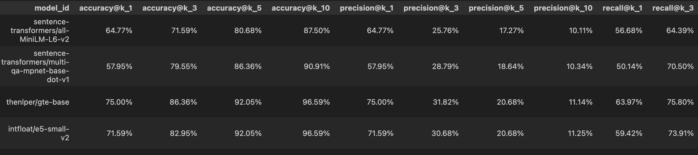

# Automated Selection of the Best Embeddings Model for Semantic Search

## Overview

This project automates the process of evaluating and selecting the best embeddings model for a given dataset. By comparing various models using relevant performance metrics, it identifies the most suitable embeddings approach tailored to the dataset's characteristics.

The project is meant to evaluate embeddings for your specific text corpus so `recommended dataset` sizes are small. E.g. 20k or 50k or 100k corpus size.

## Features

- **Automated Model Selection**: Evaluates multiple embeddings models without manual intervention.
- **Text Datasets**: Works with text datasets that require embeddings
- **Automated Metrics Evaluation and Model Comparison**: accuracy@k, precision@k, recall@k, ndcg@k, mrr@k, map@k
- **Logging & Reports**: Generates reports on model performance for easy analysis and comparison.

## Installation

```
# Clone the repository
git clone https://github.com/mailio/automated-embeddings-selection.git
cd automated-embeddings-evaluation

# Install dependencies
pip install -r requirements.txt
```

## Usage

### 1. Prepare your Dataset (corpus)

Ensure your dataset is available in structured format following the object model: 
```python
class MessageType(Enum):
    HTML = "html"
    TEXT = "text"

@dataclass
class Email:
    folder: str # not used (can be empty)
    message_type: MessageType # for cleanup of html if HTML
    sender_name: str # sender (or author of the text)
    sender_email: str # email (of the author)
    message_id: str # Id of the text
    created: int # created timestamp in miliseconds since epoch
    subject: Optional[str] = None # subject or title of the text
    sentences: Optional[List[str]] = field(default_factory=list) # list of sentences
```

You can find an example of dataset extraction (tailored to Mailio) in `nbs/01_collect_emails.ipynb`

Specific configuraton for collecting Mailio emails in `.env` configuration

```yaml
COUCHDB_USER=admin
COUCHDB_PASSWORD=pass
COUCHDB_URL=http://localhost:5984
COUCHDB_DBNAME=dbname
OPEN_API_KEY=key
```

The output is a `.jsonl` file or files with structure: 
```json
{"folder": "goodreads", "message_type": "html", "sender_name": "Apple Developer", "sender_email": "developer@insideapple.apple.com", "message_id": "<916070119.9201668.1733252044340@insideapple.apple.com>", "created": 1733252044000, "subject": "Hello Developer: December 2024", "sentences": ["In this edition: The year in sessions, activities, apps, and games.", "DECEMBER 2024Hello DeveloperTake a look back at highlights from an incredible year for the Apple Developer community  and get ready for whats next.THE YEAR IN SESSIONSRevisit the most-viewed videos from WWDC24With Apple Intelligence", ...]}
```

## 2. Prepare your evaluation Dataset

For Mailio purposes the evaluation Dataset is created using `ChatGpt 4o mini` model to create evaluation queries. The example script can be found in `nbs/04_create_evaluation_dataset.ipynb`. 

The script expects `single jsonl file` with format: 
```json
{"text": "The Ultimate Machine Learning Resources for Beginners and\r\n Intermediate Enthusiasts The Ultimate Machine Learning Resources for Beginners and Intermediate.Enthusiasts Generated by DALL.E LLMs My colabs from PyTorch for Deep learning & Machine Learning Youtube videoLinear. Igor Technology", "id": "<20240220215448.985812f423015a7e@igor.technology>", "query": "Machine Learning resources by igor"}
```

## 3. Prepare configuration

```yaml
# where to store the embeddings and other data
data_folder: data

# Recreate embeddings for all models if True; otherwise, skip existing embeddings.
force_embedding_creation: False

# Evaluation dataset for model comparison
evaluation_dataset: data/evaluation_dataset/sample_queries_cleaned.jsonl

# output evaluation results file
results_output: data/results.jsonl

# list of models to compare (all loadable by HuggingFace transformers libraries)
models:
  - sentence-transformers/all-MiniLM-L6-v2
  - sentence-transformers/multi-qa-mpnet-base-dot-v1
  - thenlper/gte-base
  - intfloat/e5-small-v2
  - google-bert/bert-base-uncased
```

## 4. Run the script

```
python3 find_best_embedding_model.py --config find_best_embedding_model.yaml
```

## 5. View results

The result exploration notebook is in `explore/explore_results.ipynb`

Results format `jsonl`:
```json
{"model_id":"intfloat\/e5-small-v2","similarity_function":"cosine","problematic_queries_count":3,"problematic_queries":["Akontacija DDPO junij 2020","Photo ID pickup details for Igor Rendulic","Zoom invitation on April 21, 2021"],"avg_embedding_time":0.1232,"accuracy@k":{"1":0.7159090909,"3":0.8295454545,"5":0.9204545455,"10":0.9659090909},"precision@k":{"1":0.7159090909,"3":0.3068181818,"5":0.2068181818,"10":0.1125},"recall@k":{"1":0.5942234848,"3":0.7391098485,"5":0.8125,"10":0.8584280303},"ndcg@k":{"10":0.2006664699},"mrr@k":{"10":0.7955312049},"map@k":{"100":0.7082197894}}
```

Example of formatted output:


# Possible Improvements

## Dynamic Configuration

- Allow dynamic configuration of evaluation metrics (e.g., adding or removing metrics like `precision@k`, `recall@k`, etc.).

## Scalability Improvements

- Optimize the code for larger datasets (e.g., 1M+ documents).

## Integration with Other Tools

- Integrate with vector databases (e.g., Pinecone, Weaviate, or Milvus) for real-time embeddings storage and retrieval.

## Advanced Metrics

- Include additional evaluation metrics like R-precision, F1@k, or custom domain-specific metrics.

- Add support for evaluating models on multiple datasets simultaneously.

## Documentation and Tutorials

Expand the documentation with detailed examples and tutorials for different use cases.

# Contributing

Contributions are welcome! Feel free to submit issues or pull requests to improve the tool.

# License

See LICENSE for details.

# Acknowledgments

Special thanks to the NLP and ML communities on [HuggingFace](https://huggingface.co/) for providing open-source embeddings models and evaluation frameworks.
